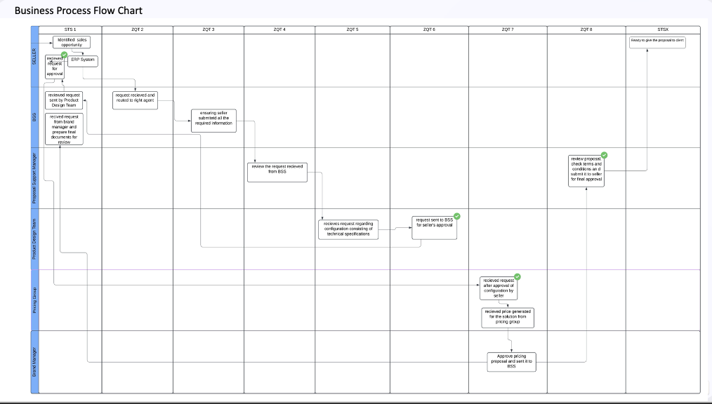
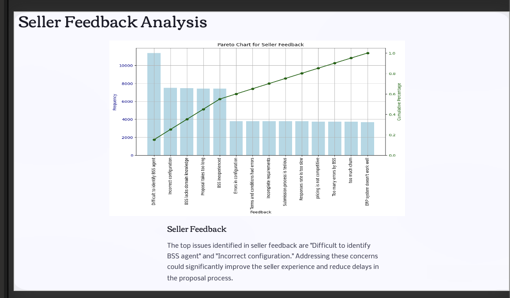
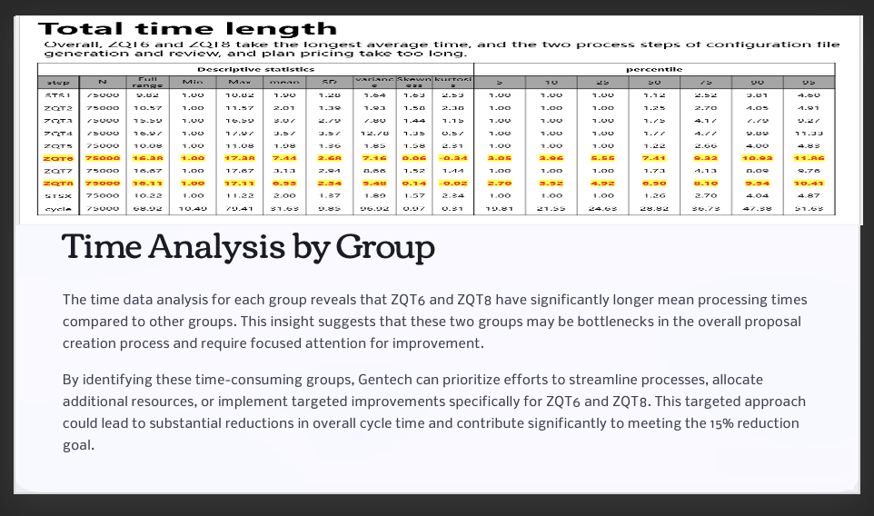
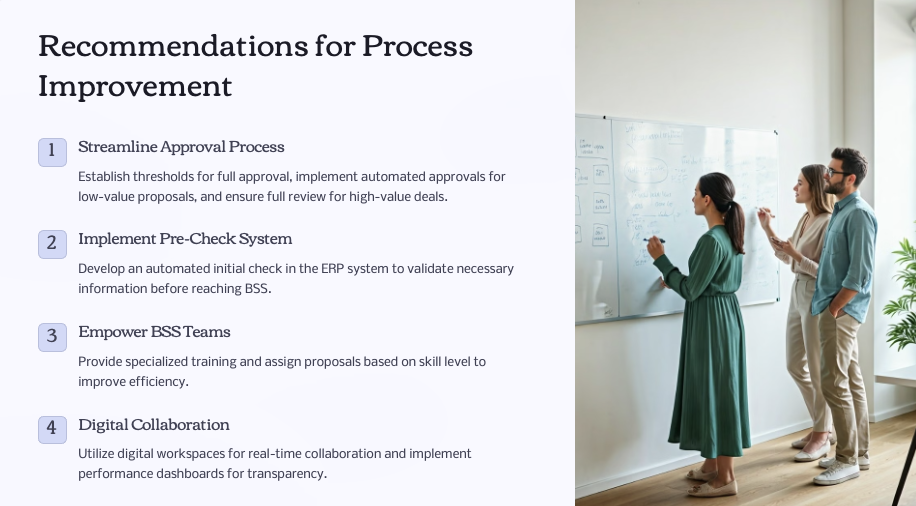

# Business Process Optimization (Lean Six Sigma / DMAIC) — Gentech Case Study

Lean Six Sigma (DMAIC) process optimization case study — reduced proposal cycle time **15%** across **5 global regions**.

## Business Problem
Proposal creation faced delays and rework, causing SLA misses and impacting revenue performance.

## Goal
Improve SLA adherence (target: **95% within 35 days**) by reducing cycle time by **15%**.

## Scope & Data
- Coverage: **5 global regions**
- Volume analyzed: **75,000** proposal transactions
- Bottlenecks identified: **ZQT6 / ZQT8**

## Approach
- Process mapping (workflow swimlane) + VA/NVA analysis
- Root cause analysis using Pareto + Fishbone (RCA)
- Risk assessment using FMEA; prioritized improvements by impact/effort

## Key Recommendations
- Standardized intake fields/templates to reduce rework
- Approval thresholds / low-risk auto-approvals to reduce waiting time
- Pre-check validation + KPI monitoring to sustain improvements

## Results
- **15% cycle time reduction**
- Improved SLA adherence by targeting bottleneck steps (**ZQT6 / ZQT8**)

## Key Visuals

## Files
- Slide deck: `/docs/Streamlining-the-Proposal-Creation-Process-at-Gentech.pptx`

## Skills Used
DMAIC, process mapping, VA/NVA, Pareto, Fishbone (RCA), FMEA, KPI design, control plan
